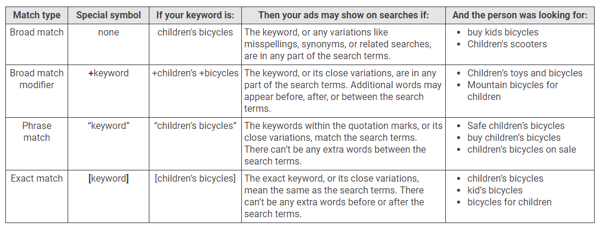
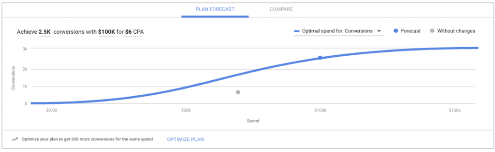

# Google Ads

Every second, people turn to Google for the information they need to get things done. Google Ads is a digital advertising solution that helps you reach this audience and transform them into valuable customers.

# Google Ads

Picking the right match type for your keywords can help you show your ads to the right people. Take a look at all the match types below to see how they broaden or narrow your reach.

https://www.google.com/search/howsearchworks/

# William Vickrey (3 Days before death)

William Spencer Vickrey (21 June 1914 – 11 October 1996) was a Canadian-American professor of economics and Nobel Laureate. Vickrey was awarded the 1996 Nobel Memorial Prize in Economic Sciences with James Mirrlees for their research into the economic theory of incentives under asymmetric information, becoming the only Nobel laureate born in British Columbia.

The announcement of his Nobel Prize was made just **three days prior to his death**. Vickrey died while traveling to a conference of Georgist academics that he helped found and never missed once in 20 years.His Columbia University economics department colleague C. Lowell Harriss accepted the posthumous prize on his behalf. There are only three other cases where a Nobel Prize has been presented posthumously.

https://en.wikipedia.org/wiki/William_Vickrey

Vickrey Auction

https://en.wikipedia.org/wiki/Vickrey_auction

## Search Creative Best Practises

https://services.google.com/fh/files/misc/creativebestpracticesguide.pdf

# Forecasting Tool (Performance Planner)

Performance Planner (Budget Planner) is a forecasting tool that uses machine learning to reveal the possibilities for your Google Ads campaigns. With this tool, you can explore forecasts for your upcoming monthly, quarterly, and annual budgets for current campaigns, while also helping to improve your return on investment.

> Based on 250 random Google Ads Customer IDs*, Performance Planner highlighted how to find an average 43% increase in conversions — for the same investment — by reallocating bids and budgets between campaigns. It's also been seen to highlight how to grow conversions by 80% for the same CPA (no diminishing returns).
> 
> *Source: Internal Performance Planner pipeline data